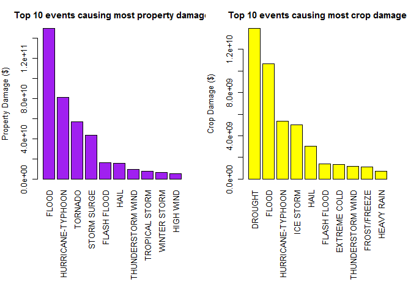

---
output:
  html_document:
    keep_md: yes
    #toc: yes
---
# Analysis of Weather Impacts in the USA Based on the NOAA Storm Database (Reproducible Research Project2)

Date: 28-02-2018

=============================================================================================

## Synopsis

The NOAA (National Oceanic & Atmospheric Administration) Storm Database contains characteristics of major weather events in the US. This project will fetch the data, make it tidy and then aggregate the following:  

1. Most harmful events to human health (fatalities and injuries). 
2. Events that have strongest damages to property and crop.


## Data Processing

```r
setwd("C:/Users/mingfuliu/RepData_PeerAssessment2")
data <- read.csv("repdata_data_StormData.csv.bz2")
data$EVTYPE = toupper(data$EVTYPE)
dim(data)
```

```
## [1] 902297     37
```

```r
head(data)
```

```
##   STATE__           BGN_DATE BGN_TIME TIME_ZONE COUNTY COUNTYNAME STATE
## 1       1  4/18/1950 0:00:00     0130       CST     97     MOBILE    AL
## 2       1  4/18/1950 0:00:00     0145       CST      3    BALDWIN    AL
## 3       1  2/20/1951 0:00:00     1600       CST     57    FAYETTE    AL
## 4       1   6/8/1951 0:00:00     0900       CST     89    MADISON    AL
## 5       1 11/15/1951 0:00:00     1500       CST     43    CULLMAN    AL
## 6       1 11/15/1951 0:00:00     2000       CST     77 LAUDERDALE    AL
##    EVTYPE BGN_RANGE BGN_AZI BGN_LOCATI END_DATE END_TIME COUNTY_END
## 1 TORNADO         0                                               0
## 2 TORNADO         0                                               0
## 3 TORNADO         0                                               0
## 4 TORNADO         0                                               0
## 5 TORNADO         0                                               0
## 6 TORNADO         0                                               0
##   COUNTYENDN END_RANGE END_AZI END_LOCATI LENGTH WIDTH F MAG FATALITIES
## 1         NA         0                      14.0   100 3   0          0
## 2         NA         0                       2.0   150 2   0          0
## 3         NA         0                       0.1   123 2   0          0
## 4         NA         0                       0.0   100 2   0          0
## 5         NA         0                       0.0   150 2   0          0
## 6         NA         0                       1.5   177 2   0          0
##   INJURIES PROPDMG PROPDMGEXP CROPDMG CROPDMGEXP WFO STATEOFFIC ZONENAMES
## 1       15    25.0          K       0                                    
## 2        0     2.5          K       0                                    
## 3        2    25.0          K       0                                    
## 4        2     2.5          K       0                                    
## 5        2     2.5          K       0                                    
## 6        6     2.5          K       0                                    
##   LATITUDE LONGITUDE LATITUDE_E LONGITUDE_ REMARKS REFNUM
## 1     3040      8812       3051       8806              1
## 2     3042      8755          0          0              2
## 3     3340      8742          0          0              3
## 4     3458      8626          0          0              4
## 5     3412      8642          0          0              5
## 6     3450      8748          0          0              6
```
After setting the 'data' frame, first of all, we need fix up event types. Cookbook indicates events have some variation in name spelling, such as FLOOD and THUNDERSTORM WIND. Therefore, we need to change the names of these events as follows.


```r
data[data$EVTYPE == "HURRICANE/TYPHOON", ]$EVTYPE = "HURRICANE-TYPHOON"
data[data$EVTYPE == "HURRICANE", ]$EVTYPE = "HURRICANE-TYPHOON"
data[data$EVTYPE == "RIVER FLOOD", ]$EVTYPE = "FLOOD"
data[data$EVTYPE == "THUNDERSTORM WINDS", ]$EVTYPE = "THUNDERSTORM WIND"
data[data$EVTYPE == "TSTM WIND", ]$EVTYPE = "THUNDERSTORM WIND"
```
We will now proceed to generate some Results

## Results

### 1. 10 Most harmful events to human health across the United States

We then count four types of damage: fatality (FATALITIES) , injury (INJURIES), property damage (PROPDMG) and crop damage (CROPDMG) , while the latter two should be calculated with magnitude, PROPDMGEXP and CROPDMGEXP. The first two items related to human health directly, we summarized these two types of data here.


```r
fatalities <- aggregate(FATALITIES ~ EVTYPE, data = data, sum)
fatalities <- fatalities[fatalities$FATALITIES > 0, ]
fatalities_desc <- fatalities[order(fatalities$FATALITIES, decreasing = TRUE), ]
head(fatalities_desc, n = 10)
```

```
##                EVTYPE FATALITIES
## 755           TORNADO       5633
## 116    EXCESSIVE HEAT       1903
## 138       FLASH FLOOD        978
## 243              HEAT        937
## 417         LIGHTNING        816
## 683 THUNDERSTORM WIND        701
## 154             FLOOD        472
## 523       RIP CURRENT        368
## 320         HIGH WIND        248
## 19          AVALANCHE        224
```

We code the fatality aggregates by event type and rank them in the decreasing order. We can find that tornado and excessive heat are of the most events which cause fatalities in the past years since 1950. 

Next, we will summary the data of injury.


```r
injuries <- aggregate(INJURIES ~ EVTYPE, data = data, sum)
injuries <- injuries[injuries$INJURIES > 0, ]
injuries_desc <- injuries[order(injuries$INJURIES, decreasing = TRUE), ]
head(injuries_desc, n = 10)
```

```
##                EVTYPE INJURIES
## 755           TORNADO    91346
## 683 THUNDERSTORM WIND     9353
## 154             FLOOD     6791
## 116    EXCESSIVE HEAT     6525
## 417         LIGHTNING     5230
## 243              HEAT     2100
## 386         ICE STORM     1975
## 138       FLASH FLOOD     1777
## 212              HAIL     1361
## 364 HURRICANE-TYPHOON     1321
```

Then we can draw a panel of two figures to depict the event impact order on fatality and injury.

***Fatality and Injuries***


```r
par(mfrow = c(1, 2), mar = c(12, 4, 3, 2), mgp = c(3, 1, 0), cex = 0.8)
barplot(fatalities_desc[1:10, 2], col = "black", las=3, names.arg = fatalities_desc[1:10, 1], ylab = "Fatality",  main = "Top 10 events causing most fatalities")
barplot(injuries_desc[1:10, 2], col = "red", las=3, names.arg = injuries_desc[1:10, 1], ylab = "Injured people", main = "Top 10 events causing most injuries")
```

<!-- -->

Events cause both major fatality and body injury are as follows.


```r
intersect(fatalities_desc[1:10, 1], injuries_desc[1:10, 1])
```

```
## [1] "TORNADO"           "EXCESSIVE HEAT"    "FLASH FLOOD"      
## [4] "HEAT"              "LIGHTNING"         "THUNDERSTORM WIND"
## [7] "FLOOD"
```

**7 types of events are listed in both top 10 of fatality events and top 10 body injury events. Tornado is the most harmful event to human health, while others include excessive heat, flash flood, and thunderstorm wind.**

### 2. Events Causing Property Damage and Crop Damage in the United States

Here, we summarize the property damage and crop damage caused by these natural events


***Property Damage and Crop Damage***


```r
unique(data$PROPDMGEXP)
```

```
##  [1] K M   B m + 0 5 6 ? 4 2 3 h 7 H - 1 8
## Levels:  - ? + 0 1 2 3 4 5 6 7 8 B h H K m M
```


```r
unique(data$CROPDMGEXP)
```

```
## [1]   M K m B ? 0 k 2
## Levels:  ? 0 2 B k K m M
```

From the cookbook, the letter "K" stands for thousands, while "M" for millions and "B" for billions. Since we find both upper and lower case from these letters, we need to transform the exponential terms back into actual values


```r
data[data$PROPDMGEXP == "K", ]$PROPDMG <- data[data$PROPDMGEXP == "K", ]$PROPDMG * 1000 
data[data$PROPDMGEXP == "M", ]$PROPDMG <- data[data$PROPDMGEXP == "M", ]$PROPDMG * 1e+06 
data[data$PROPDMGEXP == "m", ]$PROPDMG <- data[data$PROPDMGEXP == "m", ]$PROPDMG * 1e+06 
data[data$PROPDMGEXP == "B", ]$PROPDMG <- data[data$PROPDMGEXP == "B", ]$PROPDMG * 1e+09 
data[data$CROPDMGEXP == "K", ]$CROPDMG <- data[data$CROPDMGEXP == "K", ]$CROPDMG * 1000 
data[data$CROPDMGEXP == "k", ]$CROPDMG <- data[data$CROPDMGEXP == "k", ]$CROPDMG * 1000 
data[data$CROPDMGEXP == "M", ]$CROPDMG <- data[data$CROPDMGEXP == "M", ]$CROPDMG * 1e+06 
data[data$CROPDMGEXP == "m", ]$CROPDMG <- data[data$CROPDMGEXP == "m", ]$CROPDMG * 1e+06 
data[data$CROPDMGEXP == "B", ]$CROPDMG <- data[data$CROPDMGEXP == "B", ]$CROPDMG * 1e+09 
```

We can then aggregate the propery damage and crop damage by event types and rank them in decreasing order.


```r
damages <- aggregate(PROPDMG ~ EVTYPE, data = data, sum)
damages <- damages[damages$PROPDMG > 0, ]
damages_desc <- damages[order(damages$PROPDMG, decreasing = TRUE), ]
head(damages_desc, n = 10)
```

```
##                EVTYPE      PROPDMG
## 154             FLOOD 149776655307
## 364 HURRICANE-TYPHOON  81174159010
## 755           TORNADO  56937160779
## 597       STORM SURGE  43323536000
## 138       FLASH FLOOD  16140812067
## 212              HAIL  15732267048
## 683 THUNDERSTORM WIND   9704038802
## 769    TROPICAL STORM   7703890550
## 884      WINTER STORM   6688497251
## 320         HIGH WIND   5270046295
```

**Flood is the most harmful event to property damage, while the second most harmful event is hurricane (typhoon).**


```r
crop_damages <- aggregate(CROPDMG ~ EVTYPE, data = data, sum)
crop_damages <- crop_damages[crop_damages$CROPDMG > 0, ]
crop_damages_desc <- crop_damages[order(crop_damages$CROPDMG, decreasing = TRUE), ]
head(crop_damages_desc, n = 10)
```

```
##                EVTYPE     CROPDMG
## 84            DROUGHT 13972566000
## 154             FLOOD 10691427450
## 364 HURRICANE-TYPHOON  5349782800
## 386         ICE STORM  5022113500
## 212              HAIL  3025954473
## 138       FLASH FLOOD  1421317100
## 125      EXTREME COLD  1312973000
## 683 THUNDERSTORM WIND  1159505188
## 187      FROST/FREEZE  1094186000
## 254        HEAVY RAIN   733399800
```

**Drought is the most harmful event causing crop damage while flood and hurricane (typhoon) are the second and third harmful events.**

The following is to use a panel of two figures to show the 10 most harmful events causing property damage and crop damage.

***Property Damage and Crop Damage***


```r
par(mfrow = c(1, 2), mar = c(12, 4, 3, 2), mgp = c(3, 1, 0), cex = 0.8)
barplot(damages_desc[1:10, 2], col = "purple", las = 3, names.arg = damages_desc[1:10, 1], ylab = "Property Damage ($)", main = "Top 10 events causing most property damage")
barplot(crop_damages_desc[1:10, 2], col = "yellow", las = 3, names.arg = crop_damages_desc[1:10, 1], ylab = "Crop Damage ($)", main = "Top 10 events causing most crop damage")
```

<!-- -->

**The two sequences of events causing property and crop damages are different.**

we can then add these two types of damages together to see their sum damage.


```r
total_damages <- merge(damages_desc, crop_damages_desc, by = "EVTYPE")
total_damages$total = total_damages$PROPDMG + total_damages$CROPDMG
total_damages_desc <- total_damages[order(total_damages$total, decreasing = TRUE), ]
total_damages_desc[1:5, ]
```

```
##               EVTYPE      PROPDMG     CROPDMG        total
## 19             FLOOD 149776655307 10691427450 160468082757
## 48 HURRICANE-TYPHOON  81174159010  5349782800  86523941810
## 82           TORNADO  56937160779   414953270  57352114049
## 66       STORM SURGE  43323536000        5000  43323541000
## 31              HAIL  15732267048  3025954473  18758221521
```

**The top 5 events cause most economic loss are - Flood, Hurricane, Tornado, Storm Surge and Hail.**


